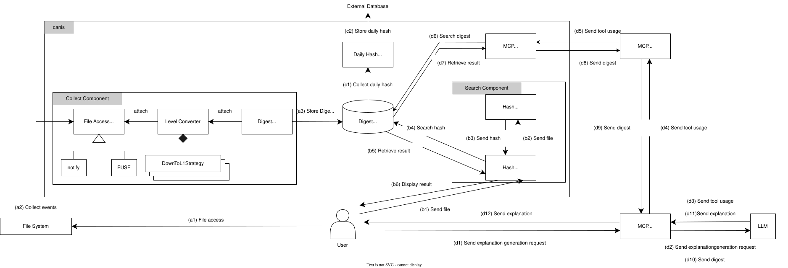

# canis-rs
canis は，計算機上でのユーザのファイル操作を監視し，契機として利用することで，研究データに関する証跡を保存するためのシステムである．
canis は以下の機能を提供している．
- ユーザのファイル操作を監視して証跡を保存する
- 指定したファイルの証跡について検索する
- 指定したファイルについて履歴を表示する (TODO)
- 1日に1回その日に作成した証跡からハッシュを作成し，公開する
- 論文中の図の情報をまとめた説明を作成する

# Requirements
## All Platforms
- Python 3.x (optional, required only when using the MCP)
- [libfuse3.14.0](https://github.com/libfuse/libfuse) (optional, required only when using the FUSE backend)

## Linux
- systemd

## Windows
- [WinSW 3.x](https://github.com/winsw/winsw)  
  - Windows はバックグラウンドで常に動かすプログラムを「サービス」という形で管理します．  
  しかし， canis は元々サービス化される仕様になっていないため，WinSW を利用して Windows サービスとして登録・起動・停止・監視できるようにします．

## macOS
- launchd

# Getting Started
canis は，バックグラウンドで動作してユーザのファイル操作を監視し，以下の項目からなる証跡を作成します．
- 操作時刻
- ハッシュ値
- ファイルパス


以下に示す各コマンドの詳細については， Usage に記載しています．

1. 利用するためには，まず `init` コマンドで設定ファイルを作成します．
```
$ canis init
```
以下のような設定ファイルが作成されます．
```
  watcher_system = "notify"

  processor_level = 2

  watch_paths = ["/path/of/watch/"]

  log_file = "/path/of/canis.log"

  dailyhash_repository="/path/of/git/repository"
```

2. 作成した設定ファイルを修正します．  
`watch_paths` の項目を修正することで，監視対象を指定できます．

2. 次に `start` コマンドでファイルアクセスの監視を開始します．
```
$ canis start
```
ユーザがファイルを操作すると，ハッシュを作成し，証跡をログファイルに保存します．
これによって，データが存在していた証拠を保存できます．
作成される証跡は以下のような形式です．
```
2026-02-01T02:03:04.230445,ad56fcd90f67e70ba2f6d35779a856e70d32310cffdf61eda9885298bb83e595,/home/user/test.txt
```

# Installation
1. Releases から各 OS に対応したバイナリをダウンロードする
2. ダウンロードしたバイナリを OS ごとに以下のディレクトリに移動する
    - Linux: ~/.local/bin/
    - Windows: C:\Users\<username>\AppData\Local\canis\
    - MacOS: ~/Library/Application Support/canis/

# Configuration
## Collect Component, Search Component
設定ファイルを OS に対応して以下のディレクトリに配置する．
- Linux: `/home/<user>/.config/canis/config.toml`
- Windows: `C:\Users\<user>\AppData\Roaming\canis\config\config.toml`
- MacOS: `/Users/<user>/Library/Application/canis/config.toml`

設定ファイルには以下の情報を記載する．
- watcher_system: 監視に利用するシステムを notify または fuse から指定する．
- processor_level: 証跡作成部が対応しているインタフェースのレベルを指定する．
- watch_paths: 監視したいディレクトリのパスを指定する．notify を利用する場合は複数指定可能．FUSE を利用する場合は 1つ目の要素を監視対象パスとして選択する．
- log_file(optional): 証跡を保存するログファイルの配置場所を指定する．指定しない場合は各OSごとに以下の規定の場所に作成される．
  - Linux: `/home/<user>/.local/share/canis/canis.log`
  - Windows: `C:\Users\<user>\AppData\Roaming\canis\data\canis.log`
  - MacOS: `/Users/<user>/Library/Application/canis/canis.log`
- dailyhash_repository(oprional): 日次ハッシュを公開するGitリポジトリをクローンしたローカルリポジトリのパスを指定する．

以下に設定ファイルの例を示す．
  ```
  watcher_system = "fuse"

  processor_level = 2

  watch_paths = ["/path/of/watch/"]

  log_file = "/path/of/canis.log"

  dailyhash_repository="/path/of/git/repository"
  ```

## Upload daily hash
1. 日次ハッシュ公開先として利用する Git リポジトリを作成する．
2. 作成した Git リポジトリをローカルに Clone する．ここでは，daily-hashというリポジトリを例に示す．
  ```
  $ git clone https://github.com/User/daily-hash.git
  ```

## Model Context Protocol
- Configuration for Claude.app
```json
{
  "mcpServers": {
    "canis": {
      "command": "uv",
      "args": [
      "--directory",
      "/path/of/canis_mcp",
      "run",
      "main.py",
      "/path/of/canis/log"
      ]
    }
  }
}
```

- Configuration for VS code
```json
{
  "servers": {
    "canis": {
      "command": "uv",
      "args": [
        "--directory",
        "/path/of/canis_mcp",
        "run",
        "main.py",
        "/path/of/canis/log"
      ],
    }
  }
}
```

- `path/of/canis_mcp` : `canis_mcp` ディレクトリのパス
- `path/of/canis/log` : canisが証跡のログを保存しているファイルのパス


# Usage
## 自動起動設定
### Linux
1. 自動起動設定用のファイルを作成する
```
canis init -s
```

2. systemd の設定を再読み込みする
```
systemctl --user daemon-reload
```
3. canis start が自動起動するよう設定する
```
systemctl --user enable canis-start.service
systemctl --user start canis-start.service
```

### Windows
1. [WinSW 3.x](https://github.com/winsw/winsw) をダウンロードし，以下のディレクトリに移動　
```
C:\Users\user\AppData\Local\winsw\
```

2. 自動起動設定用のファイルを作成する
```
$ .\canis.exe init -s
```

3. 作成された xml ファイルの password 欄にパスワードを入力する

4. canis start をサービスとして登録し，開始する
```
$ .\WinSW-x64.exe install .\canis-start.xml
$ .\WinSW-x64.exe start .\canis-start.xml
```

### MacOS
1. 自動起動設定用のファイルを作成する
```
canis init -s
```

2. canis start が自動起動するよう設定する
```
launchctl load ~/Library/LaunchAgents/com.canis.start.plist
```

## Commands
- canis -h
```
Timestamping System for Research Data Management

Usage: canis <COMMAND>

Commands:
  init     Generate service file for current OS
  start    Start canis system
  stop     Stop canis system
  info     Display digest about file
  publish  Publish daily hash
  help     Print this message or the help of the given subcommand(s)

Options:
  -h, --help  Print help
```

- canis init -h
```
Generate template files for configuration

Usage: canis init [OPTIONS]

Options:
  -c, --config   Generate only config file
  -s, --start    Generate only service file for start
  -p, --publish  Generate only service file for publish
  -h, --help     Print help
```

- canis start -h
```
Start canis system

Usage: canis start [OPTIONS]

Options:
  -c, --config <CONFIG>  Specify config file
  -d, --daemon           Start background
  -h, --help             Print help
```

- canis stop -h
```
Stop canis system

Usage: canis stop

Options:
  -h, --help  Print help
```

- canis info -h (TODO)
```
Display digest about file

Usage: canis info [OPTIONS] <FILEPATH>

Arguments:
  <FILEPATH>  Path to the file to search

Options:
  -l, --log   Generate log about file
  -h, --help  Print help
```

- canis publish -h (TODO)
```
Publish daily hash

Usage: canis publish

Options:
  -h, --help  Print help
```

## examples
### init コマンド
```
canis init
```
以下の3つの設定ファイルが生成されます  
1. 監視対象等を指定するファイル  
各 OS ごとに対応した場所に `config.toml` ファイルを作成します
```
  watcher_system = "fuse"

  processor_level = 2

  watch_paths = ["/path/of/watch/"]

  log_file = "/path/of/canis.log"

  dailyhash_repository="/path/of/git/repository"
```
2. canis start を自動起動するファイル
  - Linux  
  `~/.config/systemd/user/` に `canis-start.service` ファイルを作成します
  ```
  [Unit]
  Description=canis-start

  [Service]
  Type=simple
  User={username}
  ExecStart=%h/.local/bin/canis start --config {config_path}
  Restart=always

  [Install]
  WantedBy=default.target
  ```
  - Windows  
  `C:\Users\user\AppData\Local\winsw\` に `canis-start.xml` ファイルを作成します
  ```
  <service>
    <id>canis-run</id>
    <name>canis-run</name>
    <description>canis-run</description>
    <executable>{exe_path}</executable>
    <arguments>start --config {config_path}</arguments>
    <serviceaccount>
      <username>{domain}\{username}</username>
      <password></password>
      <allowservicelogon>true</allowservicelogon>
    </serviceaccount>
  </service>
  ```
  - MacOS  
  `~/Library/LaunchAgents/` に `com.canis.start.plist` ファイルを作成します
  ```
  <?xml version="1.0" encoding="UTF-8"?>
  <!DOCTYPE plist PUBLIC "-//Apple//DTD PLIST 1.0//EN"
    "http://www.apple.com/DTDs/PropertyList-1.0.dtd">
  <plist version="1.0">
  <dict>
      <key>Label</key>
      <string>com.{username}.canis-start</string>

      <key>ProgramArguments</key>
      <array>
          <string>{bin_path}</string>
          <string>start</string>
          <string>--config</string>
          <string>{config_path}</string>
      </array>

      <key>KeepAlive</key>
      <true/>

      <key>RunAtLoad</key>
      <true/>

      <key>StandardOutPath</key>
      <string>{log_dir}/canis-start.log</string>

      <key>StandardErrorPath</key>
      <string>{log_dir}/canis-start.err</string>
  </dict>
  </plist>
  ```
3. canis publish を定期実行するファイル(TODO)

### info コマンド(TODO)
```
canis info FILEPATH
```
保存した証跡から `FILEPATH` について検索し，以下のような情報を出力します．
```
作成時刻: 2026-02-01T02:03:04.230445
ファイル: /home/user/test.txt
ハッシュ: ad56fcd90f67e70ba2f6d35779a856e70d32310cffdf61eda9885298bb83e595
```
ここから，検索した `FILEPATH` のハッシュ値となるファイルがいつから存在していたかを示すために利用できます．


# システム構成
## 構成要素


1. 本システムの証跡を収集する機能は，以下の要素から構成されている．
   - File Access Monitor: ユーザのファイル操作を監視し，証跡を作成するべき操作を取得した場合はレベル変換部にファイル操作情報を通知する
   - Level Converter: ファイルアクセス監視部と証跡作成部間のアダプタ．取得したファイル操作情報を証跡作成部が対応している操作の情報に変換し，通知する
   - Digest Generator: 取得したファイル操作情報に基づいて証跡を作成し，証跡保存データベースに保存する
   - Digest Database: システムが作成した証跡を保存するデータベース
   - Hash Generator: ユーザが指定したファイルのハッシュ値を作成する
   - Hash Searcher: ユーザが指定したファイルのハッシュ値が保存されているか検索し，結果を表示する
   - Daily Hash Generator: 1日に1回その日の証跡一覧から日時ハッシュを取得し，外部に公開する
   - MCP Host: ユーザからの説明作成依頼を LLM に送信する．また，LLM から tool 利用に必要な情報を取得し，MCP クライアントから tool の実行結果を取得する．
   - MCP Client: MCP ホストから tool 利用に必要な情報を取得し，情報に基づいて必要な tool を呼び出す．呼び出した tool の動作結果を取得し，MCP ホストに送信する．
   - MCP Server: MCP クライアントから取得した tool 利用情報をもとに対応した tool を実行する．実行結果は MCP クライアントに送信する．
   - LLM: MCP ホストから説明作成依頼を取得し，説明を作成する．また，説明作成に必要な情報を取得するために tool に必要な情報を MCP ホストに送信する．

## インタフェース
File Access Monitor から Level Converter および， Level Converter から Digest Generator は以下のインタフェースに基づいたメッセージが通知される．
 - レベル1
   - create(filepath,time)
   - modify(filepath,time)
 - レベル2
   - move(filepath1, filepath2,time)
 - レベル3
   - open(filepath,pid,time)
   - write(filepath,content,time)
   - append(filepath, content,time)
